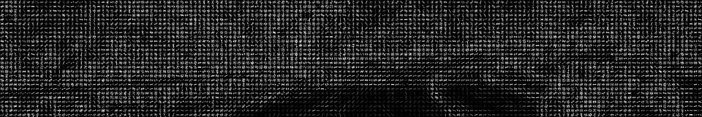
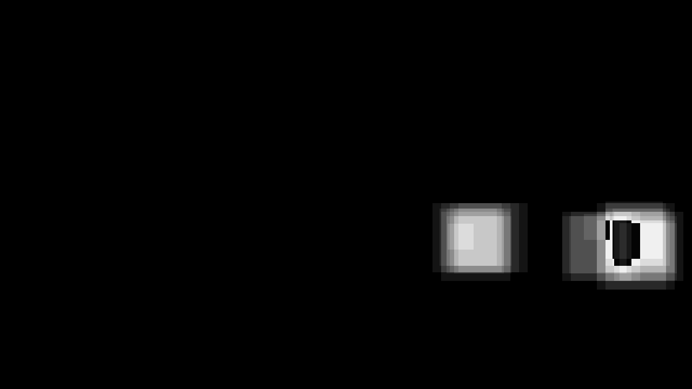

**Vehicle Detection Project**

## Writeup

### Introduction

The goals / steps of this project are the following:

* Perform Histogram of Oriented Gradients (HOG) feature extraction on a labeled training set of images to train a Linear SVM classifier.
* Use a trained classifier coupled with a sliding-window technique to search for vehicles in images/videos.
* Run this pipeline on a video stream to create heat maps (integrations) of recurring detections for outlier rejection and vehicle following.
* Estimate and render bounding boxes for vehicles detected.

### Environment

Minimum execution environment is undefined.

Project was developed using the following environment:

| Category | Item        |
|----------|-------------|
| OS       | Windows 10 |
| CPU      | Intel i7/6800k |
| RAM      | 64GB |
| GPU      | nVidia GTX 1060 |
| VRAM     | 6GB |
| Storage  | SATA SSD |

[//]: # (Image References)

[this]: https://github.com/michael-kitchin/CarND-Vehicle-Detection
[train_classifier.py]: ./train_classifier.py
[process.py]: ./process.py
[image.py]: ./util/image.py
[classifier.py]: ./util/classifier.py
[running_mean.py]: ./util/running_mean.py

### Execution

This capability consists of the following scripts:
* [train_classifier.py] Creates and trains a scaler/classifier on a supplied collection of car/non-car images, then stores these objects with their configuration in a Python pickle file for subsequent execution.
* [process.py] Loads previously trained scaler/classifier and their configuration, then applies these to supplied images and/or videos in order to detect and highlight cars.
* [image.py] Library of image management functions based on course material.
* [classifier.py] Library of classifier-related functions based on course material.
* [running_mean.py] Support class for managing running means of NumPy arrays.

#### train_classifier.py

Supported arguments (defaults are observed, best values):

| Argument | Description | Default / Best Value |
|:-------:|-------------|----------------------|
| `--vehicle-image-path` | Vehicle training image path. | `./training_images/vehicles` |
| `--non-vehicle-image-path` |  Non-vehicle training image path. | `./training_images/non-vehicles` |
| `--output-classifier-file` | File name for stored, trained objects. | `./classifier_data.p` |
| `--test-fraction` | Fraction of training images to set aside for verification. | `0.2` |
| `--color-space` | Color space for training/execution. | `YCrCb` |
| `--image-size` | Image size to scale training/execution images to (in pixels). | `[32,32]` |
| `--histogram-bins` | Number of histogram bins for color feature detection. | `32` |
| `--hog-size` | HOG window size (in pixels). | `[64,64]` |
| `--hog-orientation` | HOG orientation count. | `9` |
| `--hog-px-per-cell` | HOG pixels per cell. | `8` |
| `--hog-cell-per-blk` | HOG cells per block. | `2` |
| `--hog-channel` | HOG channel | `ALL`, `0`,`1`, or`2` |

Example execution (Windows, w/in JetBrains IntelliJ):
```
C:\Tools\Anaconda3\envs\bc-project-gpu-1\python.exe C:\Users\mcoyo\.IntelliJIdea2017.3\config\plugins\python\helpers\pydev\pydev_run_in_console.py 55719 55720 E:/Projects/Work/Learning/CarND/CarND-Vehicle-Detection/train_classifier.py --vehicle-image-path=./training_images/vehicles --non-vehicle-image-path=./training_images/non-vehicles
Running E:/Projects/Work/Learning/CarND/CarND-Vehicle-Detection/train_classifier.py
import sys; print('Python %s on %s' % (sys.version, sys.platform))
sys.path.extend(['E:\\Projects\\Work\\Learning\\CarND\\CarND-Vehicle-Detection', 'E:/Projects/Work/Learning/CarND/CarND-Vehicle-Detection'])
Python 3.5.4 | packaged by conda-forge | (default, Dec 18 2017, 06:53:03) [MSC v.1900 64 bit (AMD64)]
Type 'copyright', 'credits' or 'license' for more information
IPython 6.2.1 -- An enhanced Interactive Python. Type '?' for help.
Args: Namespace(color_space='YCrCb', histogram_bins=32, hog_cell_per_blk=2, hog_channel='ALL', hog_orientation=9, hog_px_per_cell=8, hog_size='[64,64]', image_size='[32,32]', non_vehicle_image_path='./training_images/non-vehicles', output_classifier_file='./classifier_data.p', test_fraction=0.2, vehicle_image_path='./training_images/vehicles')
Extracting vehicle features...
8792 vehicle features extracted.
Extracting non-vehicle features...
8968 non-vehicle features extracted.
Training classifier...
Classifier trained.
 True/Positive: 99.2%
False/Positive: 0.3%
 True/Negative: 99.7%
False/Negative: 0.8%
Saving classifier to ./classifier_data.p.
Classifier saved to ./classifier_data.p.
```

#### process.py

Supported arguments (defaults are observed, best values):

| Argument | Description | Default / Best Value |
|:-------:|-------------|----------------------|
| `--input-path` | Input search path for images/videos (supports wildcards and MP4, JPG, and PNG files). | `./*.mp4` |
| `--output-dir` | Output directory for processed images/videos and interim images. | `./output_videos` |
| `--input-video-range` | Start/stop subset of input video to process (in seconds). | `[]`=full video, `[x,y]`=(x) to (y) |
| `--window-scales` | Scales and image fractions for HOG feature extraction. | (see below) |
| `--window-min-score` | Minimum decision function score for inclusion.| `1.5` |
| `--match-threshold` | Minimum averaged heat map score for inclusion. | `1.0` |
| `--match-min-size` | Minimum detected feature size for inclusion (in pixels). | `[16,16]` |
| `--match-average-frames` | Number of frame heat maps to average. | `20` |
| `--match-average-recalc` | Frame interval to recalc average heat map. | `100` |
| `--video-frame-save-interval` | Frame interval to save interim images. | `40` |

Example execution (Windows, w/in JetBrains IntelliJ):
```
C:\Tools\Anaconda3\envs\bc-project-gpu-1\python.exe C:\Users\mcoyo\.IntelliJIdea2017.3\config\plugins\python\helpers\pydev\pydev_run_in_console.py 56761 56762 E:/Projects/Work/Learning/CarND/CarND-Vehicle-Detection/process.py --input-path=./test_images/*.jpg --output-dir=./output_images --input-video-range=[0.0,2.0]
Running E:/Projects/Work/Learning/CarND/CarND-Vehicle-Detection/process.py
import sys; print('Python %s on %s' % (sys.version, sys.platform))
sys.path.extend(['E:\\Projects\\Work\\Learning\\CarND\\CarND-Vehicle-Detection', 'E:/Projects/Work/Learning/CarND/CarND-Vehicle-Detection'])
Python 3.5.4 | packaged by conda-forge | (default, Dec 18 2017, 06:53:03) [MSC v.1900 64 bit (AMD64)]
Type 'copyright', 'credits' or 'license' for more information
IPython 6.2.1 -- An enhanced Interactive Python. Type '?' for help.
Args: Namespace(input_classifier_file='./classifier_data.p', input_path='./test_images/*.jpg', input_video_range='[0.0,2.0]', match_average_frames=20, match_average_recalc=100, match_min_size='[16,16]', match_threshold=1.0, output_dir='./output_images', video_frame_save_interval=40, window_min_score=1.5, window_scales='[\n    [0.5, 0.75, [0.0, 1.0], [0.5, 0.9]],\n    [0.6, 0.75, [0.0, 1.0], [0.5, 0.9]],\n    [1.0, 0.5, [0.3333, 0.6666], [0.55, 0.9]],\n    [1.3333, 0.5, [0.0, 1.0], [0.5, 0.75]],\n    [2.0, 0.0, [0.25, 0.75], [0.55, 0.65]]\n]')
Classifier args: Namespace(color_space='YCrCb', histogram_bins=32, hog_cell_per_blk=2, hog_channel='ALL', hog_orientation=9, hog_px_per_cell=8, hog_size='[64,64]', image_size='[32,32]', non_vehicle_image_path='./training_images/non-vehicles', output_classifier_file='./classifier_data.p', test_fraction=0.2, vehicle_image_path='./training_images/vehicles')
Loading ./test_images\test1.jpg (image)...
./test_images\test1.jpg (image) loaded.
Detecting vehicles...
Vehicles detected: [((800, 373), (959, 519)), ((1040, 373), (1278, 519))]
Loading ./test_images\test2.jpg (image)...
./test_images\test2.jpg (image) loaded.
Detecting vehicles...
Vehicles detected: (none)
Loading ./test_images\test3.jpg (image)...
./test_images\test3.jpg (image) loaded.
Detecting vehicles...
Vehicles detected: [((900, 414), (947, 461))]
Loading ./test_images\test4.jpg (image)...
./test_images\test4.jpg (image) loaded.
Detecting vehicles...
Vehicles detected: [((800, 376), (975, 519)), ((1040, 376), (1265, 535))]
Loading ./test_images\test5.jpg (image)...
./test_images\test5.jpg (image) loaded.
Detecting vehicles...
Vehicles detected: [((800, 360), (975, 519)), ((1080, 392), (1231, 519))]
Loading ./test_images\test6.jpg (image)...
./test_images\test6.jpg (image) loaded.
Detecting vehicles...
Vehicles detected: [((800, 360), (959, 519)), ((1000, 376), (1215, 535))]
```
---

## Rubric Points

### [Rubric Points](https://review.udacity.com/#!/rubrics/513/view) are discussed individually with respect to the implementation.

---

### 1. Writeup / README

#### 1.1 Provide a Writeup / README that includes all the rubric points and how you addressed each one (...).

_The writeup / README should include a statement and supporting figures / images that explain how each rubric item was addressed, and specifically where in the code each step was handled._

See: GitHub [repo][this].

---

### 2. Histogram of Oriented Gradients (HOG)
       
#### 2.1 Explain how (and identify where in your code) you extracted HOG features from the training images (...).

_Explanation given for methods used to extract HOG features, including which color space was chosen, which HOG parameters (orientations, pixels_per_cell, cells_per_block), and why._

Feature extraction is perfomed by the `extract_features` function in the `classifier.py` script and is based on project source material. This function combines spatial bin (scaled input), color histogram, and HOG channels in feature vectors for training/verification. HOG channels have vastly greater representation in feature vectors, suggesting a dominant role in detection performance. Inclusion of input image data (spatial bins) in these vectors was a later addition but proved notably beneficial.   

The following HOG parameter and color space defaults supplied in project source material proved sufficient for very high apparent accuracy (98+%):

| Parameter | Value |
|---------------------|---------|
| Color Space | YCrCb |
| Spatial Bins | 32 x 32 |
| Histogram Bins | 32 |
| HOG Orientations | 9 |
| HOG Pixels Per Cell | 8 |
| HOG Cells Per Block | 2 |
| HOG Channel | All |

Experimentation was performed with (e.g.) alternative color spaces without productive results.

The luminance channel (Y) vs chrominance (Cr, Cb) was observed to be particularly useful for brighter, more-distant detections, as shown in test image #3 (detection area outlined):

Hog vs luminance (Y): 


Hog vs chrominance (Cr):


Hog vs chrominance (Cb):


#### 2.2 Describe how (and identify where in your code) you trained a classifier using your selected HOG features (and color features if you used them).

_The HOG features extracted from the training data have been used to train a classifier, could be SVM, Decision Tree or other. Features should be scaled to zero mean and unit variance before training the classifier._

Classifier training is performed in the body of the `train_classifier.py` script. Classification is perfomed by a `LinearSVC` scaling by a `StandardScaler`.

Training/verification was performed using both car and non-car images from project source material.  

---

### 3. Sliding Window Search
       
### 3.1 Describe how (and identify where in your code) you implemented a sliding window search (...).

_A sliding window approach has been implemented, where overlapping tiles in each test image are classified as vehicle or non-vehicle. Some justification has been given for the particular implementation chosen._

Sliding-window detection is perfomed in the `get_hit_boxes` function in the `process.py` script.  

This function superimposes a sliding-window approach onto the same technique applied previously in training as follows:
1. For each configured scale and image subset:
    1. Subset and scale input image
    1. Generate spatial bin, color histogram, and HOG channels
    1. For each partially-overlapping window within the image subset:
        1. Generate and combine feature vectors for applicable fractions of above channels
        1. Apply decision function to combined feature vector
        1. If decision function result (classifier score) is greater than configured minimum, include in output 

An early discovery in development was the poor cost/benefit performing channel (spatial bin, color histogram, HOG) generation per window vs the entire image. Applying this step to the entire image subset drastically improved performance with no loss in capability.
 
Scales, image subsets, and overlap fraction were derived from project source material, guesswork, and as much experimentation as the project timeline allowed.

In particular, cars in the mid-vertical and horizontal periphery of the search area proved difficult to detect (e.g., test image #3). Additional scales and fractions were added until there was usable detection improvement at the cost of many window steps and a notable increase in processing time (average ~2.9sec/frame).

The final configuration is as follows:

| Window Size (vs HOG size) | Overlap | Search Area (Fractions) |
|-------------|---------|------------|
| 32x32 (0.5x) | 0.0 | x=0.0-1.0 y=0.5-0.9 |
| 48x48 (0.6x)| 0.5 | x=0.0-1.0 y=0.5-0.9 |
| 64x64 (1x) | 0.5 | x=0.3-0.6 y=0.5-0.9 |
| 112x112 (1.3x) | 0.75 | x=0.0-1.0 y=0.5-0.75 |
| 128x128 (2x) | 0.75 | x=0.25-0.75 y=0.5-0.65 |


### 3.2 Show some examples of test images to demonstrate how your pipeline is working (...).

_Some discussion is given around how you improved the reliability of the classifier i.e., fewer false positives and more reliable car detections (this could be things like choice of feature vector, thresholding the decision function, hard negative mining etc.)_

Classifier optimization followed suggestions from project source material and past experience.

For image and video processing:
* Training on both car and non-car images, split into randomly-allocated training and validation sets
* Filtering detections by only including those above configured minimum decision function result (classifier score)
* Summing detections in a heat map to accomplish the following:
    * Aggregating detection boxes into larger areas
    * Filtering overall results by only including heat map sums above configured minimum threshold (binary map)
        
For video processing, specifically:
* Heat map sums are averaged over multiple frames to minimize transient effects (e.g., passing shadows, pavement changes)    

Iterim product images were stored for each test image as development aids, as shown:

Test image #4 (input):


Test image #4 (detections):


Test image #4 (HOG luminance (y), scale 4):


Test image #4 (heat map):


Test image #4 (binary map):


Test image #4 (output; two cars, two detections; transitional shade/pavement):


Other test image output:

Test image #1 (two cars, two detections; bright sun, asphalt):


Test image #2 (no cars, no detections; bright sun, asphalt):


Test image #3 (one car, one detection; bright sun, asphalt):


Test image #5 (two cars, two detections; transitional shade, concrete overpass):


Test image #6 (two cars, two detections; transitional shade/pavement):


---

### 4. Video Implementation
    
#### 4.1. Provide a link to your final video output. Your pipeline should perform reasonably well on the entire project video (...).

_The sliding-window search plus classifier has been used to search for and identify vehicles in the videos provided. Video output has been generated with detected vehicle positions drawn (bounding boxes, circles, cubes, etc.) on each frame of video._

See [Project Video #1](./output_videos/project_video.mp4) for final project video.

See [Test Video #1](./output_videos/test_video.mp4) for project test video.

#### 4.2 Describe how (and identify where in your code) you implemented some kind of filter for false positives and some method for combining overlapping bounding boxes (...).

_A method, such as requiring that a detection be found at or near the same position in several subsequent frames, (could be a heat map showing the location of repeat detections) is implemented as a means of rejecting false positives, and this demonstrably reduces the number of false positives. Same or similar method used to draw bounding boxes (or circles, cubes, etc.) around high-confidence detections where multiple overlapping detections occur._

Heat map generation and averaging is perfomed in the `process_image` function in the `process.py` script. Averaging is performed in the `RunningMean` class in the `running_mean.py` script, a general-purpose running (windowed) mean capability for NumPy arrays.

Heat maps are used to aggregate high-confidence areas, then are averaged from frame to frame to minimize transient effects (e.g., passing shadows, pavement changes).

Once heat maps are generated they are reduced to binary maps, then labled using the `scipy.ndimage.measurements.label` function. The bounds of these labels are the basis for boxes drawn over detections in output video frames.

This coupled with the filtering techniques described in (3.1) minimize false positives from spurious detections while sustaining likely ongoing/previous detections.

---

### 5. Discussion

#### 5.1 Briefly discuss any problems / issues you faced in your implementation of this project (...).

_Discussion includes some consideration of problems/issues faced, what could be improved about their algorithm/pipeline, and what hypothetical cases would cause their pipeline to fail._

This capabiliy requires considerable processing power applied during training and execution to achieve usable detection performance, to the point it may be impractical to implement in applications without commensurate optimization of underlying algorithms (e.g., pre-filtering, convolution) and implementations (e.g., lower-level programming systems). 

This prospect suggests a such a capability may not be conveniently and interactively designed (as we have done) to coerce and aggregate this type/fidelity of input into actionable information. 

Other projects in this program demonstrate that developers may be better off abstracting this functionality using neural networks, effectively enabling applications to generate their own optimal processing pipelines (or meaningful portions thereof).

The correct approach comes down to selecting the right tool for the job. In the case of this project, for example processing power/execution time isn't a pressing concern and there are many unexplored input management and execution scope opportunities yet to be considered.

Either way, scikit-learn, Keras, TensorFlow, and NumPy (to name a few) have been incredible tools to learn and use for these projects and I look forward to leveraging them extensively in the future.
